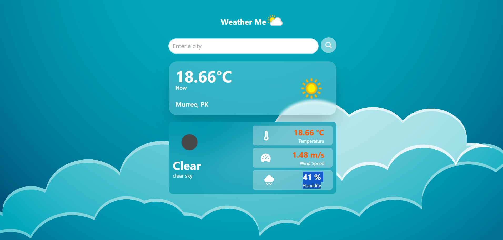

# 🌦️ Django Weather App – Real-Time Forecasts with API Integration  

🚀 **Just Built a Dynamic Weather App Using Django & OpenWeatherMap API!**  

I'm excited to showcase my latest project—a **real-time weather application** built with:  
- **Django** (Backend)  
- **OpenWeatherMap API** (Live Data)  
- **Bootstrap** (Responsive UI)  

🔹 **Key Features:**  
✔️ Current weather & forecasts  
✔️ City-based search  
✔️ Clean, mobile-friendly design  
✔️ Error handling for invalid locations  

💡 **Tech Stack:** Python, Django, REST API, HTML/CSS  

📌 **Want to try it yourself?** Clone & run locally:  

```bash
git clone https://github.com/muhammadtaha0022/django-weather-app.git
cd django-weather-app
python -m venv venv
source venv/bin/activate  # Linux/Mac | venv\Scripts\activate (Windows)
pip install -r requirements.txt
python manage.py runserver
```
*(Don’t forget to add your own `API_KEY` in `settings.py`!)*  

🔗 **GitHub Repo:** [github.com/muhammadtaha0022/django-weather-app](https://github.com/muhammadtaha0022/django-weather-app)  

Would love your feedback! 👇 #Django #Python #API #WebDev #OpenSource  


**Note:** Replace `API_KEY` with your OpenWeatherMap API key for full functionality.  


## 📞 Contact Information 

### Direct Contacts 
- **Mobile:** [+92 301 0224443](tel:+923010224443)
- **WhatsApp:** [+92 301 0224443](https://wa.me/923010224443)
- **Email:** [muhammadtaha00224443@gmail.com](mailto:muhammadtaha00224443@gmail.com)

### Professional Profiles
- **LinkedIn:** [Muhammad Taha](https://www.linkedin.com/in/muhammad-taha-taha)
- **GitHub:** [muhammadtaha0022](https://github.com/muhammadtaha0022)
